# 并发的解决方案

## 一、背景

学java大抵快一年了，从环境部署到框架搭建，当自己的知识面到达了一定的地步后，之前觉得玄之又玄不敢碰的高并发问题就堂而皇之的摆在眼前了。这里整理一下如何利用virtualBox和docker搭建一个微服务集群自己玩。

未来可期，能走多远，我也不知道，但我知道自己的方向，所以每走一步，都会比上一步更远。。

### 1. 突发大流量请求问题

#### 限流：

使用nginx的限流或gateway的限流操作将并发数限制在可承受范围，多余的请求将返回降级后的信息，如

503，当前访问人数过多，请稍后再试。

#### 消息队列：

使用kafka将请求的消息存入消息队列，进行缓冲，再由消费者依次调用相关的处理程序进行处理

### 2. 分布式锁

秒杀扣库问题

### 3. 表单重复提交问题

保证kafka幂等性

### 4. 分布式事务

一个服务失败所有服务回滚并给出相关提示

### 5. 服务熔断与降级的操作

并发数量过大，返回降级信息

服务突然挂掉，熔断该服务

## 二、服务搭建

### 1. 基础环境搭建

#### 工具：

镜像： CentOS-7-x86_64-DVD-2003.iso   **（注意！centos一定要版本7以上，否则没法玩）**

VirtualBox：https://www.virtualbox.org/wiki/Downloads

#### 创建与配置虚拟机

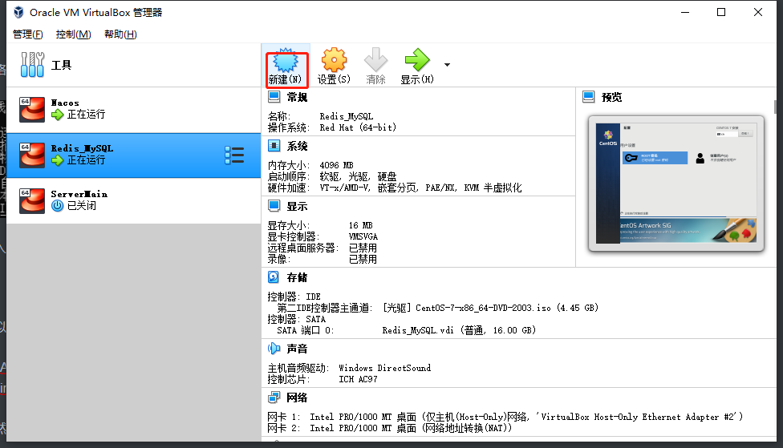

点击新建，然后按照提示操作，分别输入虚拟机名称，数据将要保存到的文件夹，类型选择linux，版本看你（此处我是redhat x64）然后点击下一步

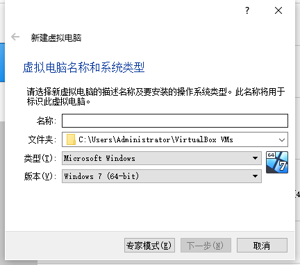

为虚拟机分配内存，依据你的要求来做，我这里做了一个放nacos，一个放数据（redis+mysql），一个放服务

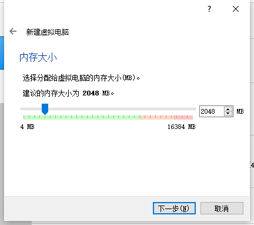

创建硬盘，除了手动修改一下你想要的硬盘大小外全部使用默认配置即可，一路下一步

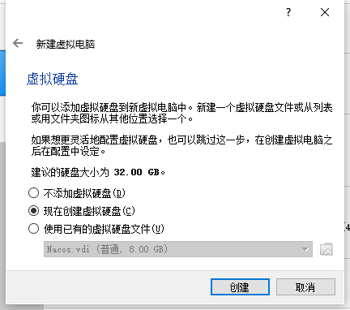

右键自己创建好的虚拟机，点击设置，在弹窗选择网络，选择桥接网卡，如果界面名称显示不出东西，那么你需要安装一个驱动，详见下面的[无法找到桥接网卡的办法](#1. 虚拟机桥接网卡的问题，找不到桥接网卡解决方案：)

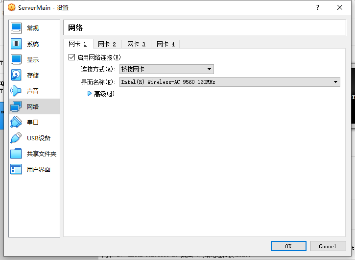

设置好后点击确定进入虚拟机安装centos（在使用了docker技术后，理论上是不需要我们多个虚拟机操作了的，但是为了，但是为了联系多台机器的部署，我还是开了三台虚拟机，分别安装centos）。

#### 安装centos

双击virtualBox界面中自己的虚拟机实例就可以打开，下一步就是选择一个镜像进行读取，当然也可以通过右键设置-存储进行注册光驱

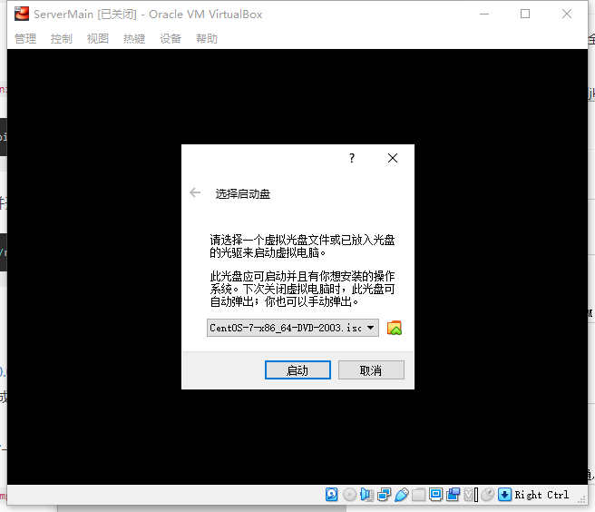

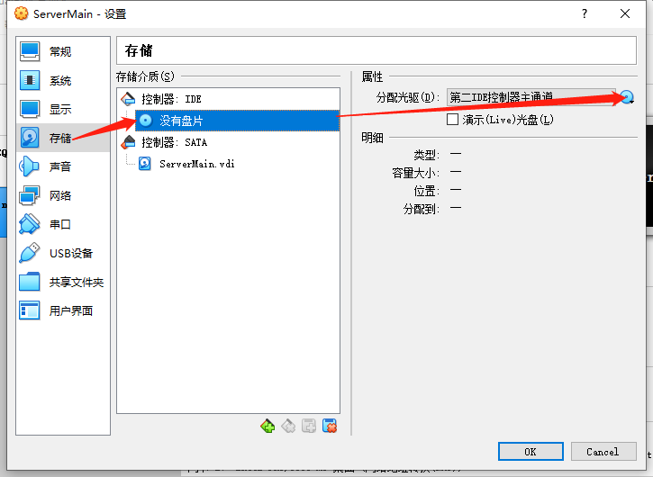

一开始界面中是没有光盘的，需要点击注册，然后选择你的镜像文件即可

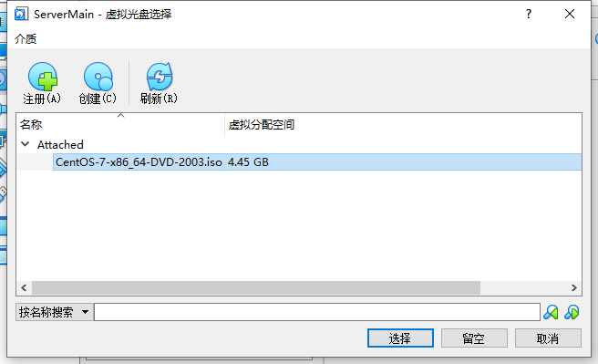

选择后虚拟机将自动进入安装界面，按提示操作即可。首先选择中文，再选择硬盘，设置登录密码，一路往下即可

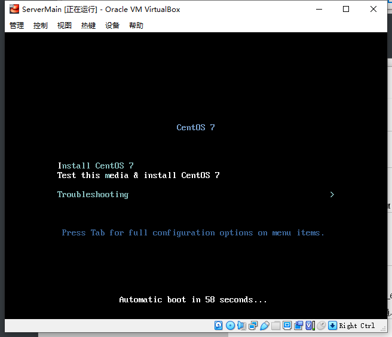

选择安装 centos等待

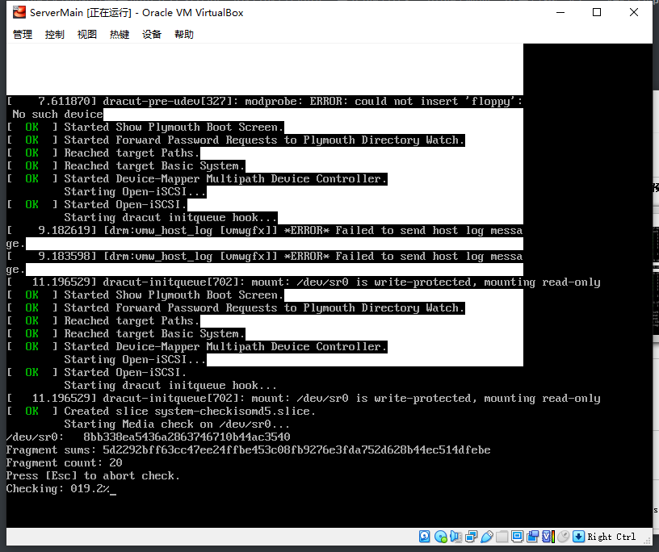

选择中文，继续

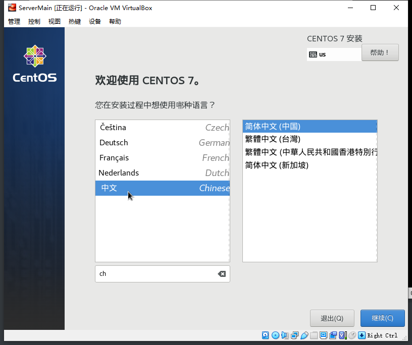

选择硬盘

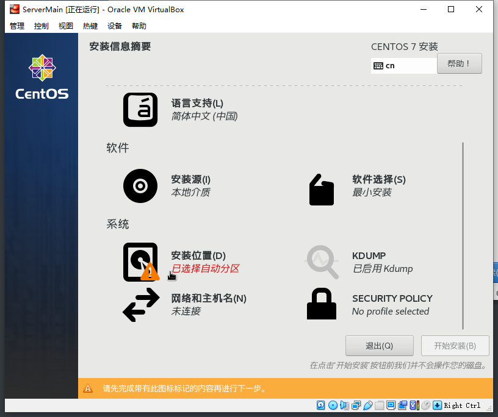

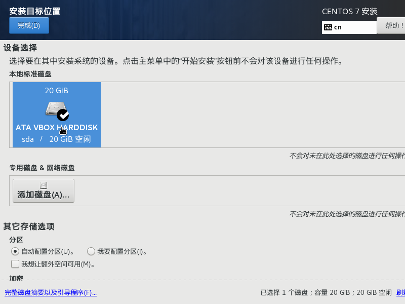

点击完成出去点击安装，等待的同时可以设置一下root密码，否则无法完成安装

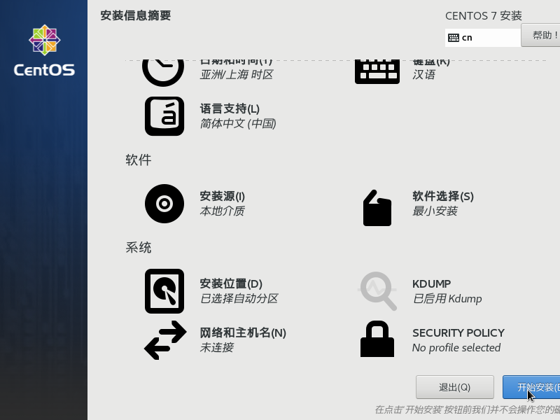

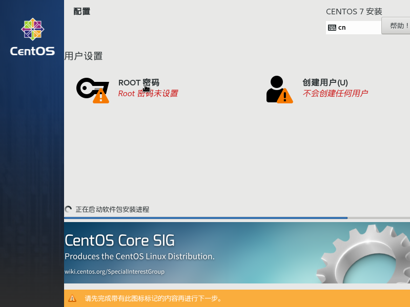

安装完毕后，接下来就是配置固定IP，参考 [完成安装后，配置固定IP](#2. 为虚拟机设置固定IP)

至此，前期准备已经完成，JDK？不存在的，docker好就好在你连JDK都不用装，直接去用就行了，而且更棒的是，人家甚至还内置cenos，可以理解成套娃，嗯。

接下来就是部署各种基础工具了。

### 2. 安装docker

~~~shell
#yum 环境安装
yum -y install yum-utils

#加一个镜像地址
sudo yum-config-manager --add-repo https://mirrors.aliyun.com/docker-ce/linux/centos/docker-ce.repo 

#直接安装
sudo yum install -y docker-ce

#添加镜像加速
sudo mkdir -p /etc/docker
sudo tee /etc/docker/daemon.json <<-'EOF'
{
  "registry-mirrors": ["https://8q0juicq.mirror.aliyuncs.com"]
}
EOF
sudo systemctl daemon-reload
sudo systemctl restart docker

#等待，完事儿
service docker start
#（可选）设置docker开机自启动
systemctl enable docker
~~~

更多高端docker操作比如自己打包镜像，后续我会慢慢放上来

### 3. 部署mysql

注意：此处务必到nacos的官方pom下看看人家支持的是哪个版本的mysql

这里是8.0.15，版本选的太高nacos不支持会报神奇的错误

比如8.0.16mysql报了神奇的错误，容器启动失败，无奈折腾了很久就是搞不定，使用了8.0.15完美解决

~~~shell
#简简单单，先找mysql
docker search mysql
#选取第一个官方镜像
docker pull mysql:8.0.16
#下载完后使用这个镜像新建一个mysql容器
docker run \
--restart=always \
--name mysql \
-p 3306:3306 \
-v /data/mysql/config:/etc/mysql/conf.d \
-v /data/mysql/log:/logs \
-v /data/mysql/data:/var/lib/mysql \
-e MYSQL_ROOT_PASSWORD=williamworkstation \
-d mysql
#注意，这里不知道为什么不能加--restart=always，加了以后容器闪退，只能执行完容器创建后重启容器，对想要加上开机自启动的容器使用如下代码配置自启动，目前还不知道为什么
docker update --restart=always [容器id]
#确认开放对应端口，使用navicat测试连接即可

~~~

### 4. 部署redis

~~~shell
#简简单单，先找redis
docker search redis
#选取第一个官方镜像
docker pull redis
#下载完后使用这个镜像新建一个redis容器
docker run \
--restart=always \
--name redis \
-p 6379:6379 \
-v /data/redis/configs:/etc/redis/redis.conf \
-v /data/redis/data:/data \
-d redis redis-server /etc/redis/redis.conf \
--requirepass "williamworkstation"
#注意，这里不知道为什么不能加--restart=always，加了以后容器闪退，只能执行完容器创建后重启容器，对想要加上开机自启动的容器使用如下代码配置自启动，目前还不知道为什么
docker update --restart=always [容器id]
#确认开放对应端口，使用redis工具测试链接即可

~~~

### 5. 部署nacos注册中心

[nacos-mysql初始化脚本地址]: https://github.com/alibaba/nacos/blob/master/config/src/main/resources/META-INF/nacos-db.sql

~~~shell
#简简单单，先找nacos
docker search nacos
#选取第一个官方镜像
docker pull nacos/nacos-server
#下载完后使用这个镜像新建一个nacos容器
docker run \
--restart=always \
-p 8848:8848 \
-e MODE=standalone \
-v /data/nacos/configs:/home/nacos/init.d \
-v /data/nacos/logs:/home/nacos/logs \
--name nacos \
-d nacos/nacos-server
#注意，这里不知道为什么不能加--restart=always，加了以后容器闪退，只能执行完容器创建后重启容器，对想要加上开机自启动的容器使用如下代码配置自启动，目前还不知道为什么
docker update --restart=always [容器id]
#在mysql中执行nacos的脚本
#脚本执行完毕后，进行nacos的配置,创建配置文件custom.properties
#配置完后重启docker容器等一段时间，nacos启动有点慢，我的机器启动大概花了1分钟

~~~

custom.properties 配置文件

~~~shell
server.contextPath=/nacos
server.servlet.contextPath=/nacos
server.port=8848

spring.datasource.platform=mysql

db.num=1
#此为nacos使用的数据库，自行按需配置，其他可以不改
db.url.0=jdbc:mysql://xx.xx.xx.x:3306/nacos_devtest_prod?characterEncoding=utf8&connectTimeout=1000&socketTimeout=3000&autoReconnect=true
db.user=user
db.password=pass

nacos.cmdb.dumpTaskInterval=3600
nacos.cmdb.eventTaskInterval=10
nacos.cmdb.labelTaskInterval=300
nacos.cmdb.loadDataAtStart=false

management.metrics.export.elastic.enabled=false

management.metrics.export.influx.enabled=false

server.tomcat.accesslog.enabled=true
server.tomcat.accesslog.pattern=%h %l %u %t "%r" %s %b %D %{User-Agent}i

nacos.security.ignore.urls=/,/**/*.css,/**/*.js,/**/*.html,/**/*.map,/**/*.svg,/**/*.png,/**/*.ico,/console-fe/public/**,/v1/auth/login,/v1/console/health/**,/v1/cs/**,/v1/ns/**,/v1/cmdb/**,/actuator/**,/v1/console/server/**
nacos.naming.distro.taskDispatchThreadCount=1
nacos.naming.distro.taskDispatchPeriod=200
nacos.naming.distro.batchSyncKeyCount=1000
nacos.naming.distro.initDataRatio=0.9
nacos.naming.distro.syncRetryDelay=5000
nacos.naming.data.warmup=true
nacos.naming.expireInstance=true
~~~

### 6. 部署kafka

~~~shell
#docker拉取kafka和zookeeper的镜像
docker pull wurstmeister/kafka
docker pull wurstmeister/zookeeper
#docker 打包yml参考官方文档
https://github.com/wurstmeister/kafka-docker/blob/master/docker-compose.yml
#这里我修改了kafka下的ports为9092:9092映射
~~~

~~~yml
version: '3'
services:
  zookeeper:
    image: wurstmeister/zookeeper
    ports:
      - "2181:2181"
  kafka:
    image: wurstmeister/kafka
    depends_on: [ zookeeper ]
    ports:
      - "9092:9092"
    environment:
      KAFKA_ADVERTISED_HOST_NAME: 10.168.1.245
      KAFKA_CREATE_TOPICS: "test:1:1"
      KAFKA_ZOOKEEPER_CONNECT: zookeeper:2181
    volumes:
      - /data/kafka/data/docker.sock:/var/run/docker.sock
~~~

**注意！！这里kafka配置文件中填写的ip地址应为宿主机ip地址！否则docker两个容器之间无法通过localhost进行通信！**

这里提一句由于centos7的问题，docker-compose 命令不存在，需要安装一些扩展源

~~~shell
sudo yum install -y wget
#讲文件下载至/usr/local/bin并重命名，再授权
cd /usr/local/bin/
#下载
wget https://github.com/docker/compose/releases/download/1.14.0-rc2/docker-compose-Linux-x86_64
#重命名
rename docker-compose-Linux-x86_64 docker-compose docker-compose-Linux-x86_64
#授予可执行权限
chmod +x /usr/local/bin/docker-compose
~~~

~~~
#在kafka-compose.yml目录中执行命令
docker-compose build
docker-compose up -d
~~~

手动安装

~~~shell
docker run --name zk -p 2181:2181  -d wurstmeister/zookeeper

docker run --name kafka \
-p 9092:9092 \
-e KAFKA_BROKER_ID=0 \
-e KAFKA_ZOOKEEPER_CONNECT=10.168.1.245:2181 \
-e KAFKA_ADVERTISED_LISTENERS=PLAINTEXT://10.168.1.245:9092 \
-e KAFKA_LISTENERS=PLAINTEXT://0.0.0.0:9092 \
-v /data/kafka/data/docker.sock:/var/run/docker.sock \
-v /etc/localtime:/etc/localtime \
wurstmeister/kafka

~~~

### 7. 部署maven和jenkins

部署jenkins

~~~bash
#拉取镜像
docker pull jenkins
#启动容器
docker run -d \
-p 12345:8080 \
-p 50000:50000 \
-v /data/jenkins:/var/jenkins_home \
--name jenkins \
--restart always \
--privileged=true  \
-u root jenkins
#--privileged : 使用该参数，container内的root拥有真正的root权限，否则，container（容器）内的root只是外部的一个普通用户权限，privileged启动的容器可以看到很多host上的设备，并且可以执行mount，甚至允许你在docker容器内启动docker容器。

#-p 50000:50000 : 如果您在其他机器上设置了一个或多个基于JNLP的Jenkins代理程序，而这些代理程序又与 jenkinsci/blueocean 容器交互（充当“主”Jenkins服务器，或者简称为“Jenkins主”）， 则这是必需的。默认情况下，基于JNLP的Jenkins代理通过TCP端口50000与Jenkins主站进行通信。

#在安装目录下修改jenkins的镜像地址
vim hudson.model.UpdateCenter.xml
#将默认路径修改为
https://mirrors.huaweicloud.com/jenkins/updates/update-center.json
#保存
#重启jsnkins

~~~

~~~
安装：
到jenkins官网下载最新的jenkins.war
重启：
nohup java -jar /tmp/jenkins.war --httpPort=8088 >/data/log/jenkins.log &

1，添加Jenkins主机免密登录
1，登录到Jenkins用户
root用户时，使用 sudo su -s /bin/bash jenkins

2， Jenkins有自己的ssh，如果需要ssh登录，需要登录到jenkins
1，登录jenkins
[root@jenkins_it3 new1_cart_DAT]# sudo su -s /bin/bash jenkins
2，找到jenkins的公钥id_rsa.pub，复制到目标机器
1，bash-4.1$ cat ~/.ssh/id_rsa.pub
2，登录目标机器，如root，vim ~/.ssh/authorized_keys，将jenkins的公钥添加进来
3，重启目标机器ssh服务
[root@node2 .ssh]# /etc/rc.d/init.d/sshd restart
4，jenkins主机，使用jenkins用户远程登录一次目标主机
bash-4.1$ ssh -l root 192.168.223.220
目的是为了让目标主机添加到jenkins用户的known_host

2，Jenkins工作目录
1，脚本位置 /var/lib/jenkins/jobs
2，代码包位置 /var/lib/jenkins/workspace
~~~

### 8. 部署高可用的seata-server

踩了无数的坑，面向百度没一个好使的教程，这里萌新踩了两天的坑，终于整理出来了最新版的基于docker+springcloud+seata高可用的分布式事务教程。记录一下。

参考文档：

http://seata.io/zh-cn/docs/ops/deploy-ha.html

为seata-server服务端新建seata库，并执行官网的建表sql脚本如下

Mysql基础表官方地址：https://github.com/seata/seata/blob/develop/script/server/db/mysql.sql

~~~sql
-- -------------------------------- The script used when storeMode is 'db' --------------------------------
-- the table to store GlobalSession data
CREATE TABLE IF NOT EXISTS `global_table`
(
    `xid`                       VARCHAR(128) NOT NULL,
    `transaction_id`            BIGINT,
    `status`                    TINYINT      NOT NULL,
    `application_id`            VARCHAR(32),
    `transaction_service_group` VARCHAR(32),
    `transaction_name`          VARCHAR(128),
    `timeout`                   INT,
    `begin_time`                BIGINT,
    `application_data`          VARCHAR(2000),
    `gmt_create`                DATETIME,
    `gmt_modified`              DATETIME,
    PRIMARY KEY (`xid`),
    KEY `idx_gmt_modified_status` (`gmt_modified`, `status`),
    KEY `idx_transaction_id` (`transaction_id`)
) ENGINE = InnoDB
  DEFAULT CHARSET = utf8;

-- the table to store BranchSession data
CREATE TABLE IF NOT EXISTS `branch_table`
(
    `branch_id`         BIGINT       NOT NULL,
    `xid`               VARCHAR(128) NOT NULL,
    `transaction_id`    BIGINT,
    `resource_group_id` VARCHAR(32),
    `resource_id`       VARCHAR(256),
    `branch_type`       VARCHAR(8),
    `status`            TINYINT,
    `client_id`         VARCHAR(64),
    `application_data`  VARCHAR(2000),
    `gmt_create`        DATETIME(6),
    `gmt_modified`      DATETIME(6),
    PRIMARY KEY (`branch_id`),
    KEY `idx_xid` (`xid`)
) ENGINE = InnoDB
  DEFAULT CHARSET = utf8;

-- the table to store lock data
CREATE TABLE IF NOT EXISTS `lock_table`
(
    `row_key`        VARCHAR(128) NOT NULL,
    `xid`            VARCHAR(96),
    `transaction_id` BIGINT,
    `branch_id`      BIGINT       NOT NULL,
    `resource_id`    VARCHAR(256),
    `table_name`     VARCHAR(32),
    `pk`             VARCHAR(36),
    `gmt_create`     DATETIME,
    `gmt_modified`   DATETIME,
    PRIMARY KEY (`row_key`),
    KEY `idx_branch_id` (`branch_id`)
) ENGINE = InnoDB
  DEFAULT CHARSET = utf8;
~~~

业务涉及的每一个库都要再有一个undo_log回滚表，比如order,finance,inventory三个库，里面分别都要建undo_log表

~~~sql
CREATE TABLE `undo_log` (
  `id` bigint(20) NOT NULL AUTO_INCREMENT,
  `branch_id` bigint(20) NOT NULL,
  `xid` varchar(100) NOT NULL,
  `context` varchar(128) NOT NULL,
  `rollback_info` longblob NOT NULL,
  `log_status` int(11) NOT NULL,
  `log_created` datetime NOT NULL,
  `log_modified` datetime NOT NULL,
  `ext` varchar(100) DEFAULT NULL,
  PRIMARY KEY (`id`),
  UNIQUE KEY `ux_undo_log` (`xid`,`branch_id`)
) ENGINE=InnoDB AUTO_INCREMENT=1 DEFAULT CHARSET=utf8;

~~~

准备好服务端的注册文件testregistry.conf，官方示例如下

~~~shell
#官方示例
registry {
  # file 、nacos 、eureka、redis、zk、consul、etcd3、sofa
  type = "file"
  loadBalance = "RandomLoadBalance"
  loadBalanceVirtualNodes = 10

  nacos {
    application = "seata-server"
    serverAddr = "127.0.0.1:8848"
    group = "SEATA_GROUP"
    namespace = ""
    cluster = "default"
    username = ""
    password = ""
  }
  eureka {
    serviceUrl = "http://localhost:8761/eureka"
    application = "default"
    weight = "1"
  }
  redis {
    serverAddr = "localhost:6379"
    db = 0
    password = ""
    cluster = "default"
    timeout = 0
  }
  zk {
    cluster = "default"
    serverAddr = "127.0.0.1:2181"
    sessionTimeout = 6000
    connectTimeout = 2000
    username = ""
    password = ""
  }
  consul {
    cluster = "default"
    serverAddr = "127.0.0.1:8500"
  }
  etcd3 {
    cluster = "default"
    serverAddr = "http://localhost:2379"
  }
  sofa {
    serverAddr = "127.0.0.1:9603"
    application = "default"
    region = "DEFAULT_ZONE"
    datacenter = "DefaultDataCenter"
    cluster = "default"
    group = "SEATA_GROUP"
    addressWaitTime = "3000"
  }
  file {
    name = "file.conf"
  }
}

config {
  # file、nacos 、apollo、zk、consul、etcd3
  type = "file"

  nacos {
    serverAddr = "127.0.0.1:8848"
    namespace = ""
    group = "SEATA_GROUP"
    username = ""
    password = ""
  }
  consul {
    serverAddr = "127.0.0.1:8500"
  }
  apollo {
    appId = "seata-server"
    apolloMeta = "http://192.168.1.204:8801"
    namespace = "application"
    apolloAccesskeySecret = ""
  }
  zk {
    serverAddr = "127.0.0.1:2181"
    sessionTimeout = 6000
    connectTimeout = 2000
    username = ""
    password = ""
  }
  etcd3 {
    serverAddr = "http://localhost:2379"
  }
  file {
    name = "file.conf"
  }
}
~~~

准备好file.conf文件，官方示例配置如下：

~~~shell
transport {
  # tcp, unix-domain-socket
  type = "TCP"
  #NIO, NATIVE
  server = "NIO"
  #enable heartbeat
  heartbeat = true
  # the client batch send request enable
  enableClientBatchSendRequest = false
  #thread factory for netty
  threadFactory {
    bossThreadPrefix = "NettyBoss"
    workerThreadPrefix = "NettyServerNIOWorker"
    serverExecutorThreadPrefix = "NettyServerBizHandler"
    shareBossWorker = false
    clientSelectorThreadPrefix = "NettyClientSelector"
    clientSelectorThreadSize = 1
    clientWorkerThreadPrefix = "NettyClientWorkerThread"
    # netty boss thread size
    bossThreadSize = 1
    #auto default pin or 8
    workerThreadSize = "default"
  }
  shutdown {
    # when destroy server, wait seconds
    wait = 3
  }
  serialization = "seata"
  compressor = "none"
}

## transaction log store, only used in server side
store {
  ## store mode: file、db
  mode = "file"
  ## file store property
  file {
    ## store location dir
    dir = "sessionStore"
    # branch session size , if exceeded first try compress lockkey, still exceeded throws exceptions
    maxBranchSessionSize = 16384
    # globe session size , if exceeded throws exceptions
    maxGlobalSessionSize = 512
    # file buffer size , if exceeded allocate new buffer
    fileWriteBufferCacheSize = 16384
    # when recover batch read size
    sessionReloadReadSize = 100
    # async, sync
    flushDiskMode = async
  }

  ## database store property
  db {
    ## the implement of javax.sql.DataSource, such as DruidDataSource(druid)/BasicDataSource(dbcp) etc.
    datasource = "druid"
    ## mysql/oracle/postgresql/h2/oceanbase etc.
    dbType = "mysql"
    driverClassName = "com.mysql.jdbc.Driver"
    url = "jdbc:mysql://127.0.0.1:3306/seata"
    user = "mysql"
    password = "mysql"
    minConn = 5
    maxConn = 30
    globalTable = "global_table"
    branchTable = "branch_table"
    lockTable = "lock_table"
    queryLimit = 100
  }
}
## server configuration, only used in server side
server {
  recovery {
    #schedule committing retry period in milliseconds
    committingRetryPeriod = 1000
    #schedule asyn committing retry period in milliseconds
    asynCommittingRetryPeriod = 1000
    #schedule rollbacking retry period in milliseconds
    rollbackingRetryPeriod = 1000
    #schedule timeout retry period in milliseconds
    timeoutRetryPeriod = 1000
  }
  undo {
    logSaveDays = 7
    #schedule delete expired undo_log in milliseconds
    logDeletePeriod = 86400000
  }
  #check auth
  enableCheckAuth = true
  #unit ms,s,m,h,d represents milliseconds, seconds, minutes, hours, days, default permanent
  maxCommitRetryTimeout = "-1"
  maxRollbackRetryTimeout = "-1"
  rollbackRetryTimeoutUnlockEnable = false
}

## metrics configuration, only used in server side
metrics {
  enabled = false
  registryType = "compact"
  # multi exporters use comma divided
  exporterList = "prometheus"
  exporterPrometheusPort = 9898
}
~~~

其中，file.conf的三种数据源官方推荐配置如下

~~~shell
## transaction log store, only used in seata-server
store {
  ## store mode: file、db、redis
  mode = "file"

  ## file store property
  file {
    ## store location dir
    dir = "sessionStore"
    # branch session size , if exceeded first try compress lockkey, still exceeded throws exceptions
    maxBranchSessionSize = 16384
    # globe session size , if exceeded throws exceptions
    maxGlobalSessionSize = 512
    # file buffer size , if exceeded allocate new buffer
    fileWriteBufferCacheSize = 16384
    # when recover batch read size
    sessionReloadReadSize = 100
    # async, sync
    flushDiskMode = async
  }

  ## database store property
  db {
    ## the implement of javax.sql.DataSource, such as DruidDataSource(druid)/BasicDataSource(dbcp)/HikariDataSource(hikari) etc.
    datasource = "druid"
    ## mysql/oracle/postgresql/h2/oceanbase etc.
    dbType = "mysql"
    driverClassName = "com.mysql.jdbc.Driver"
    url = "jdbc:mysql://127.0.0.1:3306/seata"
    user = "mysql"
    password = "mysql"
    minConn = 5
    maxConn = 100
    globalTable = "global_table"
    branchTable = "branch_table"
    lockTable = "lock_table"
    queryLimit = 100
    maxWait = 5000
  }

  ## redis store property
  redis {
    host = "127.0.0.1"
    port = "6379"
    password = ""
    database = "0"
    minConn = 1
    maxConn = 10
    maxTotal = 100
    queryLimit = 100
  }
}

~~~

我实际使用的配置

~~~shell
#testregistry.conf
registry {
  # file 、nacos 、eureka、redis、zk、consul、etcd3、sofa
  type = "nacos"  #修改为nacos，seata将注册到我们的nacos上

  #nacos注册中心配置
  nacos {
    application = "seata-server"
    serverAddr = "nacos主机的ip:8848"
    group = "可自定义的组名"
    namespace = "命名空间uid"
    cluster = "default"

    #如果nacos开启了权限控制，请配置用户名密码（此处我登录nacos是默认的，用""）
    username = ""
    password = ""
  }
}

config {
  # file、nacos 、apollo、zk、consul、etcd3
  type = "file"  #修改为nacos
  #这里我没搞定怎么使用nacos作为配置中心，同样的配置，使用nacos配置seata-server启动失败，最后不得已使用file
file {
    name = "file:/root/seata-config/file.conf"
  }
}
~~~

我的file.conf文件

~~~shell
#file.conf
db {
    ## the implement of javax.sql.DataSource, such as DruidDataSource(druid)/BasicDataSource(dbcp)/HikariDataSource(hikari) etc.
    datasource = "druid"
    ## mysql/oracle/postgresql/h2/oceanbase etc.
    dbType = "mysql"
    driverClassName = "com.mysql.cj.jdbc.Driver"
    url = "jdbc:mysql://mysql宿主机ip:3306/seata"
    user = "root"
    password = "williamworkstation"
    minConn = 5
    maxConn = 100
    globalTable = "global_table"
    branchTable = "branch_table"
    lockTable = "lock_table"
    queryLimit = 100
    maxWait = 5000
  }

~~~

准备好两个文件后，放入你自定义的文件夹下，我这里是/data/seata/config，然后拉取镜像，挂载好目录，启动镜像

~~~shell
#拉取最新的seata-server镜像文件
docker pull seataio/seata-server
#将自定义的seata注册文件丢入/data/seata/config

#指定使用自定义的注册文件启动seata-server容器
#！！！注意！！！使用docker部署seata-server如果不指定IP，后面seata-server容器的ip和宿主机一致否则后面nacos会访问172.x.x.x的docker内网ip，最后百思不得其解强行看源码debug才发现！！！
docker run --name seata-server \
-p 8091:8091 \
-e SEATA_CONFIG_NAME=file:/root/seata-config/testregistry \
-e SEATA_IP=宿主机ip \
-v /data/seata/config:/root/seata-config \
-d seataio/seata-server
#实体机的docker安装
docker run --name seata \
-p 18091:18091 \
--restart=always \
--network=host \
-e SEATA_CONFIG_NAME=file:/root/seata-config/customizedregistry \
-e SEATA_PORT=18091 \
-v /data/seata/config:/root/seata-config \
-d seataio/seata-server
~~~

回车完事儿，一看nacos有了，我们的，服务端启动大功告成，这里跟别家教程不一样，可以按照我的方法进行自定义的命名空间定义，而非全都丢进public，当然丢也没事儿，TC端本就可以是公用的。

接下来部署客户端了，这里要给nacos配置一个很丑的配置文件（貌似阿里开源这边还没有整理好，面向百度大家与我一样都是导入成功后在nacos出现巨量的配置文件）

现在你需要准备一个config.txt文件，shell脚本玩的溜的话随意。

config.txt文件中的配置项,官方参考 https://github.com/seata/seata/blob/develop/script/config-center/config.txt 如下，自行选配。

~~~shell
transport.type=TCP
transport.server=NIO
transport.heartbeat=true
transport.enableClientBatchSendRequest=false
transport.threadFactory.bossThreadPrefix=NettyBoss
transport.threadFactory.workerThreadPrefix=NettyServerNIOWorker
transport.threadFactory.serverExecutorThreadPrefix=NettyServerBizHandler
transport.threadFactory.shareBossWorker=false
transport.threadFactory.clientSelectorThreadPrefix=NettyClientSelector
transport.threadFactory.clientSelectorThreadSize=1
transport.threadFactory.clientWorkerThreadPrefix=NettyClientWorkerThread
transport.threadFactory.bossThreadSize=1
transport.threadFactory.workerThreadSize=default
transport.shutdown.wait=3
service.vgroupMapping.my_test_tx_group=default
service.default.grouplist=127.0.0.1:8091
service.enableDegrade=false
service.disableGlobalTransaction=false
client.rm.asyncCommitBufferLimit=10000
client.rm.lock.retryInterval=10
client.rm.lock.retryTimes=30
client.rm.lock.retryPolicyBranchRollbackOnConflict=true
client.rm.reportRetryCount=5
client.rm.tableMetaCheckEnable=false
client.rm.sqlParserType=druid
client.rm.reportSuccessEnable=false
client.rm.sagaBranchRegisterEnable=false
client.tm.commitRetryCount=5
client.tm.rollbackRetryCount=5
client.tm.defaultGlobalTransactionTimeout=60000
client.tm.degradeCheck=false
client.tm.degradeCheckAllowTimes=10
client.tm.degradeCheckPeriod=2000
store.mode=file
store.file.dir=file_store/data
store.file.maxBranchSessionSize=16384
store.file.maxGlobalSessionSize=512
store.file.fileWriteBufferCacheSize=16384
store.file.flushDiskMode=async
store.file.sessionReloadReadSize=100
store.db.datasource=druid
store.db.dbType=mysql
store.db.driverClassName=com.mysql.jdbc.Driver
store.db.url=jdbc:mysql://127.0.0.1:3306/seata?useUnicode=true
store.db.user=username
store.db.password=password
store.db.minConn=5
store.db.maxConn=30
store.db.globalTable=global_table
store.db.branchTable=branch_table
store.db.queryLimit=100
store.db.lockTable=lock_table
store.db.maxWait=5000
store.redis.host=127.0.0.1
store.redis.port=6379
store.redis.maxConn=10
store.redis.minConn=1
store.redis.database=0
store.redis.password=null
store.redis.queryLimit=100
server.recovery.committingRetryPeriod=1000
server.recovery.asynCommittingRetryPeriod=1000
server.recovery.rollbackingRetryPeriod=1000
server.recovery.timeoutRetryPeriod=1000
server.maxCommitRetryTimeout=-1
server.maxRollbackRetryTimeout=-1
server.rollbackRetryTimeoutUnlockEnable=false
client.undo.dataValidation=true
client.undo.logSerialization=jackson
client.undo.onlyCareUpdateColumns=true
server.undo.logSaveDays=7
server.undo.logDeletePeriod=86400000
client.undo.logTable=undo_log
client.log.exceptionRate=100
transport.serialization=seata
transport.compressor=none
metrics.enabled=false
metrics.registryType=compact
metrics.exporterList=prometheus
metrics.exporterPrometheusPort=9898
~~~

我的配置如下，其中最上面三行为我需要用到分布式事务的三个服务，分别是finance，inventory，order

~~~shell
#取名格式
service.vgroup_mapping.[随便取一个你想要的名字]=default
~~~

后面的default最好不改他，这个是后面区分集群用的，我还没研究到就不动他了

~~~shell
#等号后面均为属性值

service.vgroup_mapping.finance-service-seata=default
service.vgroup_mapping.inventory-service-seata=default
service.vgroup_mapping.order-service-seata=default
store.mode=db
store.db.datasource=dbcp
store.db.dbType=mysql
store.db.driverClassName=com.mysql.cj.jdbc.Driver
store.db.url=jdbc:mysql://10.168.1.245:3306/seata?useUnicode=true
store.db.user=root
store.db.password=williamworkstation
store.db.minConn=5
store.db.maxConn=30
store.db.globalTable=global_table
store.db.branchTable=branch_table
store.db.queryLimit=100
store.db.lockTable=lock_table
store.db.maxWait=5000

~~~

现在，下载官方导入脚本

https://github.com/seata/seata/blob/develop/script/config-center/nacos/nacos-config.sh

~~~shell
#!/usr/bin/env bash
# Copyright 1999-2019 Seata.io Group.
#
# Licensed under the Apache License, Version 2.0 (the "License");
# you may not use this file except in compliance with the License.
# You may obtain a copy of the License at、
#
#      http://www.apache.org/licenses/LICENSE-2.0
#
# Unless required by applicable law or agreed to in writing, software
# distributed under the License is distributed on an "AS IS" BASIS,
# WITHOUT WARRANTIES OR CONDITIONS OF ANY KIND, either express or implied.
# See the License for the specific language governing permissions and
# limitations under the License.

while getopts ":h:p:g:t:u:w:" opt
do
  case $opt in
  h)
    host=$OPTARG
    ;;
  p)
    port=$OPTARG
    ;;
  g)
    group=$OPTARG
    ;;
  t)
    tenant=$OPTARG
    ;;
  u)
    username=$OPTARG
    ;;
  w)
    password=$OPTARG
    ;;
  ?)
    echo " USAGE OPTION: $0 [-h host] [-p port] [-g group] [-t tenant] [-u username] [-w password] "
    exit 1
    ;;
  esac
done

if [[ -z ${host} ]]; then
    host=localhost
fi
if [[ -z ${port} ]]; then
    port=8848
fi
if [[ -z ${group} ]]; then
    group="SEATA_GROUP"
fi
if [[ -z ${tenant} ]]; then
    tenant=""
fi
if [[ -z ${username} ]]; then
    username=""
fi
if [[ -z ${password} ]]; then
    password=""
fi

nacosAddr=$host:$port
contentType="content-type:application/json;charset=UTF-8"

echo "set nacosAddr=$nacosAddr"
echo "set group=$group"

failCount=0
tempLog=$(mktemp -u)
function addConfig() {
  curl -X POST -H "${contentType}" "http://$nacosAddr/nacos/v1/cs/configs?dataId=$1&group=$group&content=$2&tenant=$tenant&username=$username&password=$password" >"${tempLog}" 2>/dev/null
  if [[ -z $(cat "${tempLog}") ]]; then
    echo " Please check the cluster status. "
    exit 1
  fi
  if [[ $(cat "${tempLog}") =~ "true" ]]; then
    echo "Set $1=$2 successfully "
  else
    echo "Set $1=$2 failure "
    (( failCount++ ))
  fi
}

count=0
#这里我做了一些修改，读取当前目录
#for line in $(cat $(dirname "$PWD")/config.txt | sed s/[[:space:]]//g); do
for line in $PWD/config.txt | sed s/[[:space:]]//g); do
  (( count++ ))
	key=${line%%=*}
    value=${line#*=}
	addConfig "${key}" "${value}"
done

echo "========================================================================="
echo " Complete initialization parameters,  total-count:$count ,  failure-count:$failCount "
echo "========================================================================="

if [[ ${failCount} -eq 0 ]]; then
	echo " Init nacos config finished, please start seata-server. "
else
	echo " init nacos config fail. "
fi
~~~

当然这里可以自定义的，我直接复制下来新建了一个.sh 脚本，名字随意，我这里在nacos部署的机器上写的脚本，对官方脚本做了一些修改，见上面的注释。

因为官方脚本默认使用localhost，萌新顺道儿学学shell，所以进去改了人家的代码，总之没挂就好

这样，config.txt放在和nacos_upload.sh同样的目录下，执行脚本就好了

运行脚本，如果你要推送到远程的nacos，那么你需要可选参数，如下

~~~shell

sh ./nacos_upload.sh -t c30291f5-1b10-4eac-a03e-54120b5cbb4d 
#这是我自己取名字粘贴脚本进去的自定义脚本
#可选参数：
-h 你要写入的nacos主机IP，默认localhost
-p 你要写入的nacos主机端口，默认8848
-group 你要写入的配置所属的组，默认SEATA_GROUP
-t 分支uuid
-username -password nacos的用户密码，好像似乎不填也可以
~~~

大功告成，一大堆配置，官方好像还没有给出什么好的办法解决这个问题，文档反正是看不懂了，丑归丑，能用。这里我试了一下，推送好配置以后，seata-server还是没能使用这里的配置，而只能使用file配置启动，所以实在没办法了，**务必确保file.config文件中的数据库配置与这里的配置一致，否则玩完！**

这里的配置主要是提供给客户端使用的，似乎跟TC服务端没什么大关联，反正我是用不了nacos配置的，求大佬指点。

下面，开始配置我们的springcloud项目

首先加入maven依赖

~~~xml
<dependency>
    <groupId>com.alibaba.cloud</groupId>
    <artifactId>spring-cloud-alibaba-seata</artifactId>
    <version>2.1.0.RELEASE</version>
</dependency>
<dependency>
    <groupId>io.seata</groupId>
    <artifactId>seata-all</artifactId>
    <version>1.3.0</version>
</dependency>
~~~

现在，你需要一个名为registry.conf的文件**直接**放置于resources目录下，并且填入如下信息

~~~shell
#让你的客户端知道去哪找服务
registry {
  type = "nacos"
  nacos {
      serverAddr = "10.168.1.246:8848"
      namespace = "c30291f5-1b10-4eac-a03e-54120b5cbb4d"
      cluster = "default"
  }
}
#让你的客户端知道去哪找配置
config {
  type = "nacos"
  nacos {
      serverAddr = "10.168.1.246:8848"
      namespace = "c30291f5-1b10-4eac-a03e-54120b5cbb4d"
      cluster = "default"
  }
}

~~~

修改你的application.yml文件添加如下代码

~~~yml
spring:
  cloud:
    alibaba:
      seata:
        enabled: true
        application-id: seata-server #nacos中seata服务端的注册名称
        enable-auto-data-source-proxy: true    #开启数据库自动代理
        tx-service-group: inventory-service-seata #这里填写上传config.txt时对应此工程的vgroupMapping配置
        #也就是刚才的
         #service.vgroup_mapping.finance-service-seata=default
		#service.vgroup_mapping.inventory-service-seata=default
		#service.vgroup_mapping.order-service-seata=default
~~~

关闭主启动项的数据源自动配置

~~~java
@SpringBootApplication(exclude = DataSourceAutoConfiguration.class)
~~~

在你的公共配置包或者本项目的配置包中添加一个数据源代理类

~~~java
package com.wwstation.config;

import javax.sql.DataSource;

import com.alibaba.druid.pool.DruidDataSource;
import com.baomidou.mybatisplus.extension.spring.MybatisSqlSessionFactoryBean;
import io.seata.rm.datasource.DataSourceProxy;
import org.apache.ibatis.session.SqlSessionFactory;
import org.mybatis.spring.SqlSessionFactoryBean;
import org.mybatis.spring.SqlSessionTemplate;
import org.springframework.boot.context.properties.ConfigurationProperties;
import org.springframework.context.annotation.Bean;
import org.springframework.context.annotation.Configuration;
import org.springframework.context.annotation.Primary;
import org.springframework.core.io.support.PathMatchingResourcePatternResolver;
import org.springframework.core.io.support.ResourcePatternResolver;

@Configuration
public class DataSourceConfig {

    /**
     * @param sqlSessionFactory SqlSessionFactory
     * @return SqlSessionTemplate
     */
    @Bean
    public SqlSessionTemplate sqlSessionTemplate(SqlSessionFactory sqlSessionFactory) {
        return new SqlSessionTemplate(sqlSessionFactory);
    }

    /**
     * 从配置文件获取属性构造datasource，注意前缀，这里用的是druid，根据自己情况配置,
     * 原生datasource前缀取"spring.datasource"
     *
     * @return
     */
    @Bean
    @ConfigurationProperties(prefix = "spring.datasource")
    public DataSource druidDataSource() {
        DruidDataSource druidDataSource = new DruidDataSource();
        return druidDataSource;
    }

    /**
     * 构造datasource代理对象，替换原来的datasource
     * @param druidDataSource
     * @return
     */
    @Primary
    @Bean("dataSource")
    public DataSourceProxy dataSourceProxy(DataSource druidDataSource) {
        return new DataSourceProxy(druidDataSource);
    }

    @Bean(name = "sqlSessionFactory")
    public SqlSessionFactory sqlSessionFactoryBean(DataSourceProxy dataSourceProxy) throws Exception {
        MybatisSqlSessionFactoryBean bean = new MybatisSqlSessionFactoryBean();
        bean.setDataSource(dataSourceProxy);
        ResourcePatternResolver resolver = new PathMatchingResourcePatternResolver();
        // bean.setConfigLocation(resolver.getResource("classpath:mybatis-config.xml"));
        bean.setMapperLocations(resolver.getResources("${mybatis-plus.mapper-locations}"));
        //这里${mybatis-plus.mapper-locations}你写自己的mapper.xml文件的路径即可

        SqlSessionFactory factory = null;
        try {
            factory = bean.getObject();
        } catch (Exception e) {
            throw new RuntimeException(e);
        }
        return factory;
    }

    //    /**
    //     * MP 自带分页插件
    //     * @return
    //     */
    //    @Bean
    //    public PaginationInterceptor paginationInterceptor() {
    //        PaginationInterceptor page = new PaginationInterceptor();
    //        page.setDialectType("mysql");
    //        return page;
    //    }
}
~~~

给你要用事务的地方加上注解,因为事务的传递性，方法内调用的其他各种奇奇怪怪的方法都不需要加事务注解了，自动代理会帮你直接管理事务。

~~~
@GlobalTransactional(rollbackFor = Exception.class)
~~~

启动项目测试即可

### 9. 部署xxl-job

~~~shell
数据库中配置好相应的sql脚本，建好库
拉镜像，注意如果不加tag将拉不下来，建议加上最新镜像
启动即可

docker run \
-e PARAMS="--spring.datasource.url=jdbc:mysql://localhost:3306/xxl_job?useUnicode=true&characterEncoding=UTF-8&autoReconnect=true&serverTimezone=Asia/Shanghai --spring.datasource.username=root --spring.datasource.password=Lk123456" \
-p 18080:8080 \
-v /data/xxl-job-admin:/data/applogs \
--name xxl-job-admin  \
-d xuxueli/xxl-job-admin:2.2.0
~~~

## 三、分布式事务框架

虽然手写底层也可以完成单点跨库的伪分布式事务操作，但这并没有什么卵用，实际集群中不可能一个transaction控制多个连接操作分布在不同主机上的mysql。

经过学习，这里选用阿里开源的Seata框架， Seata 是一款开源的分布式事务解决方案，致力于提供高性能和简单易用的分布式事务服务。Seata 将为用户提供了 AT、TCC、SAGA 和 XA 事务模式，为用户打造一站式的分布式解决方案。 

### 1. seata的高可用部署

这里我先用docker部署了一个seata-server，文档是真的不好懂，折腾了很久，最后还是自己搞定了，详见[部署seata-server](#)

## 四、参考

#### 1. 虚拟机桥接网卡的问题，找不到桥接网卡解决方案：

WLAN属性中点击安装，如图所示操作，最后找到virtualbox安装目录下\drivers\network\netlwf的VBoxNetLwf.inf文件，重启virtualbox即可。

当然，此操作也可以在网络适配器中设定

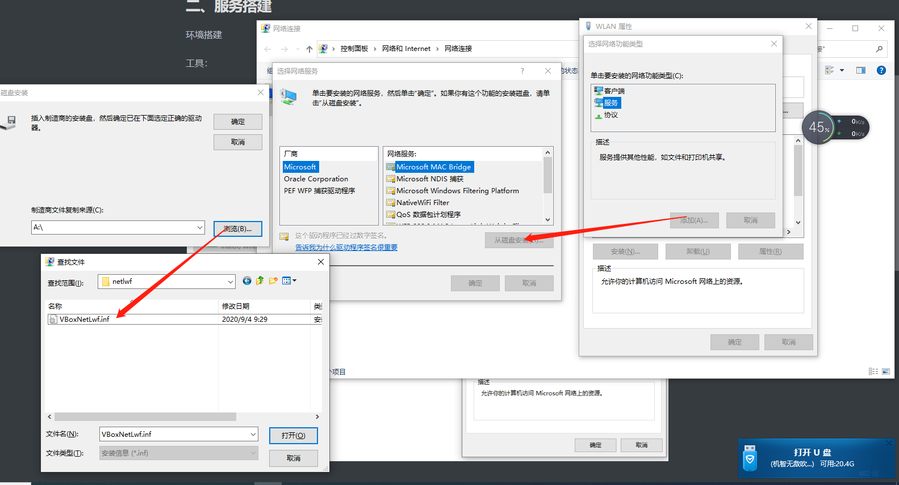

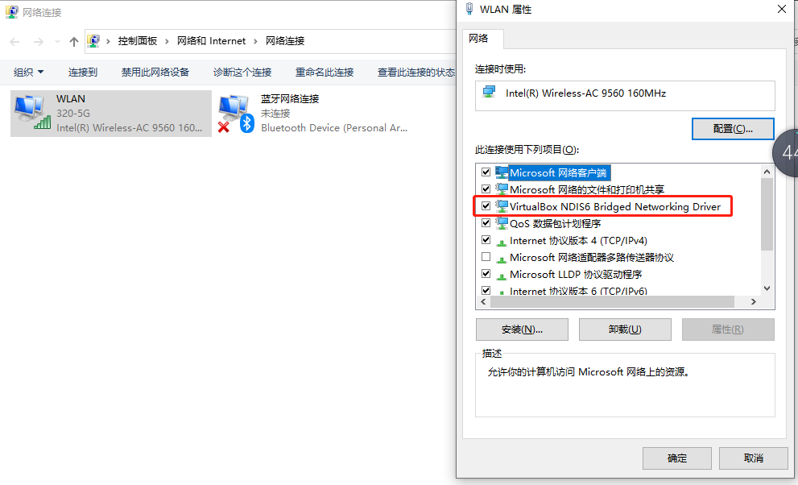

桥接成功后，虚拟机就会进入我们的局域网中，当然也可以给它们设置固定的IP地址方便我们的服务调用

#### 2. 为虚拟机设置固定IP

一个很mmp的事情，如果你不设置，那么每次你用虚拟机的时候IP都是不一样的，那程序配置里的ip就失效了，所以还玩儿毛？因此，你可以自行设置虚拟机的固定ip，这里需要你会使用wifi的固定ip设置，因为你家联网的工具如果多的话，有小概率ip冲突的情况，因此，你可能需要考虑将一些敏感IP固定起来，当然一般家里自己玩不需要设定wifi的固定ip。

言归正传，

**前提是你的虚拟机已经设定为桥接网卡并成功安装好了centos**

打开你的虚拟机输入以下指令，打开网络配置：

~~~
vi /etc/sysconfig/network-scripts/ifcfg-enp0s3
~~~

发现原始配置如下，现在我们要退到windows，看看宿主机的配置

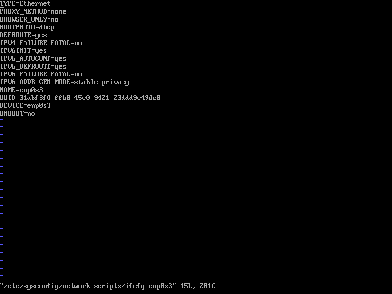

退到桌面上win+R打开cmd 输入ipconfig /all查询自己宿主机的信息，然后对应修改虚拟机中的IPADDR，NETMASK，GATEWAY即可

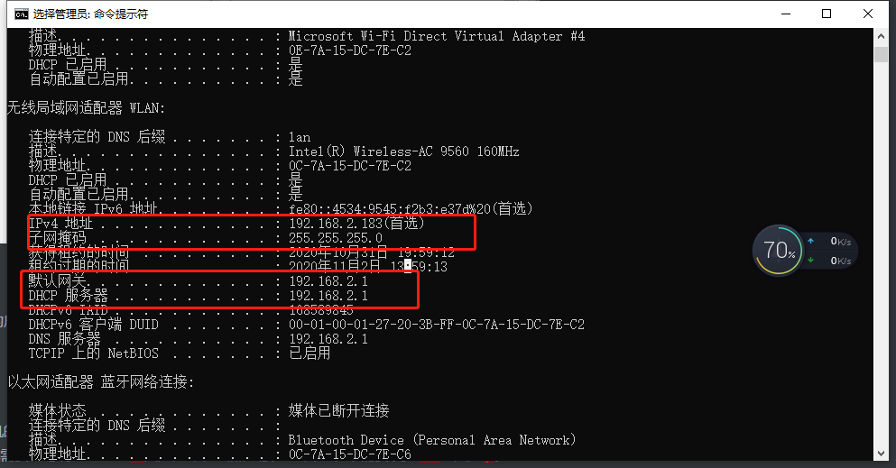

注意这些是需要设定的，修改好的配置如下

~~~shell
TYPE=Ethernet
PROXY_METHOD=none
BROWSER_ONLY=no
BOOTPROTO=static  #此处设置为static，使用指定的ip
DEFROUTE=yes
IPV4_FAILURE_FATAL=no
IPV6INIT=yes
IPV6_AUTOCONF=yes
IPV6_DEFROUTE=yes
IPV6_FAILURE_FATAL=no
IPV6_ADDR_GEN_MODE=stable-privacy
NAME=enp0s3
UUID=b65134a3-13e1-4357-9d07-10bc3fdfe85f
DEVICE=enp0s3
ONBOOT=yes #此处设置为yes
IPADDR=10.168.1.245 #此处增加IPADDR为你指定的ip，192.168.x.x网段应与你的主机一致
NETMASK=255.255.255.0 #此处增加NETMASK指定的掩码
GATEWAY=192.168.2.1 #此处增加GATEWAY指定的网关
DNS1=192.168.2.1 #此处增加DNS1，与ipconfig中的DNS配置相同（默认与网关一致）

~~~

设定完成后，service network restart重启服务或重启虚拟机均可，然后使用命令

~~~
ip addr
~~~

查看ip已经修改成功，可以尝试用 ping www.baidu.com来测试外网连通性

如果ping通，那么固定ip设定成功

#### 3. 容器之间的通信问题

在环境配置的时候，安装kafka的时候，mmp的事情发生了，kafka并没有如我们所愿的注册到zookeeper上，试想如果可以的话，平时如果不用docker其实是可以上去的。问题大抵是出在了容器和容器间互相通信的时候。百度找了一些方法无果。

引入顶级父工程依赖

~~~xml
<dependency>
    <groupId>org.springframework.boot</groupId>
    <artifactId>spring-boot-starter-web</artifactId>
</dependency>
<dependency>
    <groupId>cn.hutool</groupId>
    <artifactId>hutool-all</artifactId>
    <version>5.4.6</version>
</dependency>
<dependency>
    <groupId>org.projectlombok</groupId>
    <artifactId>lombok</artifactId>
    <version>1.18.12</version>
</dependency>
<dependency>
    <groupId>commons-lang</groupId>
    <artifactId>commons-lang</artifactId>
    <version>2.6</version>
</dependency>

<dependency>
    <groupId>io.springfox</groupId>
    <artifactId>springfox-swagger2</artifactId>
    <version>2.8.0</version>
</dependency>
<dependency>
    <groupId>io.springfox</groupId>
    <artifactId>springfox-swagger-ui</artifactId>
    <version>2.8.0</version>
</dependency>
~~~

建立相应的模块，此处不表

## bug

尝试将seata使用nacos配置并注册到nacos中

seata config不能指定namespace，只能用默认的""

~~~
registry {
  # file 、nacos 、eureka、redis、zk、consul、etcd3、sofa
  type = "nacos"  #修改为nacos，seata将注册到我们的nacos上

  #nacos注册中心配置
  nacos {
    application = "seata-server"
    serverAddr = "10.168.1.246:8848"
    #serverAddr= "10.168.1.246:8848"
    #group = "SEATA_GROUP"
    #namespace = ""
    namespace = "c30291f5-1b10-4eac-a03e-54120b5cbb4d"
    cluster = "default"

    #如果nacos开启了权限控制，请配置用户名密码
    username = ""
    password = ""
  }
}

config {
  # file、nacos 、apollo、zk、consul、etcd3
  type = "nacos"  #修改为nacos
  nacos {
      serverAddr = "10.168.1.246:8848"
      namespace = "c30291f5-1b10-4eac-a03e-54120b5cbb4d"
      #namespace = ""
      group = "SEATA_GROUP"

      username = ""
      password = ""
  }
}
~~~

解决方案：server端 registry注册到nacos，config使用本地文件，并指向命名空间dev，

client端只用写一个registry文件，可以访问对应nacos上的配置以及服务即可

### nacos寻找服务时,服务ip是docker的内网IP

服务启动时指定参数

~~~
spring:
  cloud:
    inetutils:
      ignored-interfaces: docker0
    nacos:
      discovery: 
        ip: ${服务所在宿主机的IP}
        port: ${服务的port，便于nacos去找到该服务}
~~~

~~~
docker run --name seata-server \
-p 8091:8091 \
-e SEATA_CONFIG_NAME=file:/root/seata-config/testregistry \
-e SEATA_IP=10.168.1.245 \
-v /data/seata/config:/root/seata-config \
-d seataio/seata-server
~~~

