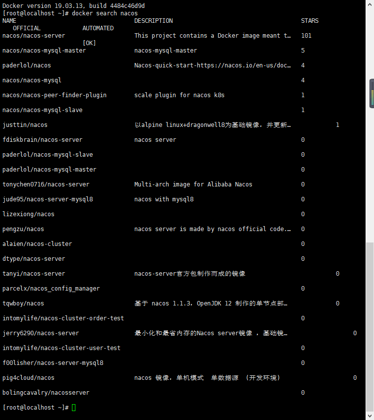

# 并发的解决方案

## 一、背景

学java大抵快一年了，从环境部署到框架搭建，当自己的知识面到达了一定的地步后，之前觉得玄之又玄不敢碰的高并发问题就堂而皇之的摆在眼前了。这里整理一下如何利用virtualBox和docker搭建一个微服务集群自己玩。

未来可期，能走多远，我也不知道，但我知道自己的方向，所以每走一步，都会比上一步更远。。

### 1. 突发大流量请求问题

#### 限流：

使用nginx的限流或gateway的限流操作将并发数限制在可承受范围，多余的请求将返回降级后的信息，如

503，当前访问人数过多，请稍后再试。

#### 消息队列：

使用kafka将请求的消息存入消息队列，进行缓冲，再由消费者依次调用相关的处理程序进行处理

### 2. 应用间抢锁问题

#### 秒杀扣库：

### 3. 表单重复提交问题

## 二、服务搭建

### 1. 基础环境搭建

#### 工具：

镜像： CentOS-7-x86_64-DVD-2003.iso   **（注意！centos一定要版本7以上，否则没法玩）**

VirtualBox：https://www.virtualbox.org/wiki/Downloads

#### 创建与配置虚拟机

点击新建，然后按照提示操作，分别输入虚拟机名称，数据将要保存到的文件夹，类型选择linux，版本看你（此处我是redhat x64）然后点击下一步

为虚拟机分配内存，依据你的要求来做，我这里做了一个放nacos，一个放数据（redis+mysql），一个放服务

创建硬盘，除了手动修改一下你想要的硬盘大小外全部使用默认配置即可，一路下一步

右键自己创建好的虚拟机，点击设置，在弹窗选择网络，选择桥接网卡，如果界面名称显示不出东西，那么你需要安装一个驱动，详见下面的[无法找到桥接网卡的办法](#1. 虚拟机桥接网卡的问题，找不到桥接网卡解决方案：)

设置好后点击确定进入虚拟机安装centos（在使用了docker技术后，理论上是不需要我们多个虚拟机操作了的，但是为了，但是为了联系多台机器的部署，我还是开了三台虚拟机，分别安装centos）。

#### 安装centos

双击virtualBox界面中自己的虚拟机实例就可以打开，下一步就是选择一个镜像进行读取，当然也可以通过右键设置-存储进行注册光驱

一开始界面中是没有光盘的，需要点击注册，然后选择你的镜像文件即可

选择后虚拟机将自动进入安装界面，按提示操作即可。首先选择中文，再选择硬盘，设置登录密码，一路往下即可

选择安装 centos等待

选择中文，继续

选择硬盘

点击完成出去点击安装，等待的同时可以设置一下root密码，否则无法完成安装

安装完毕后，接下来就是配置固定IP，参考 [完成安装后，配置固定IP](#2. 为虚拟机设置固定IP)

至此，前期准备已经完成，JDK？不存在的，docker好就好在你连JDK都不用装，直接去用就行了，而且更棒的是，人家甚至还内置cenos，可以理解成套娃，嗯。

接下来就是部署各种基础工具了。

### 2. 安装docker

~~~shell
#yum 环境安装
yum -y install yum-utils
#添加镜像加速
sudo mkdir -p /etc/docker
sudo tee /etc/docker/daemon.json <<-'EOF'
{
  "registry-mirrors": ["https://8q0juicq.mirror.aliyuncs.com"]
}
EOF
sudo systemctl daemon-reload
sudo systemctl restart docker
#加一个镜像地址
sudo yum-config-manager --add-repo https://mirrors.aliyun.com/docker-ce/linux/centos/docker-ce.repo 
#直接安装
sudo yum install -y docker-ce
#等待，完事儿
service docker start
~~~

更多高端docker操作比如自己打包镜像，后续我会慢慢放上来

### 3. 部署mysql

~~~shell
#简简单单，先找mysql
docker search mysql
#选取第一个官方镜像
docker pull mysql
#下载完后使用这个镜像新建一个mysql容器
docker run --name mysql -p 3306:3306 -v /data/mysql/config:/etc/mysql/conf.d -v /data/mysql/log:/logs -v /data/mysql/data:/var/lib/mysql -e MYSQL_ROOT_PASSWORD=williamworkstation -d mysql
#注意，这里不知道为什么不能加--restart=always，加了以后容器闪退，只能执行完容器创建后重启容器，对想要加上开机自启动的容器使用如下代码配置自启动，目前还不知道为什么
docker update --restart=always [容器id]
#确认开放对应端口，使用navicat测试连接即可

~~~

### 4. 部署redis

~~~shell
#简简单单，先找redis
docker search redis
#选取第一个官方镜像
docker pull redis
#下载完后使用这个镜像新建一个redis容器
docker run -p 6379:6379 --name redis -v /data/redis/configs:/etc/redis/redis.conf -v /data/redis/data:/data -d redis redis-server /etc/redis/redis.conf --requirepass "williamworkstation"
#注意，这里不知道为什么不能加--restart=always，加了以后容器闪退，只能执行完容器创建后重启容器，对想要加上开机自启动的容器使用如下代码配置自启动，目前还不知道为什么
docker update --restart=always [容器id]
#确认开放对应端口，使用redis工具测试链接即可

~~~

### 5. 部署nacos注册中心

~~~shell
#简简单单，先找nacos
docker search nacos
#选取第一个官方镜像
docker pull nacos/nacos-server
#下载完后使用这个镜像新建一个nacos容器
docker run -d -p 8848:8848 -e MODE=standalone -v /opt/nacos/init.d/custom.properties:/home/nacos/init.d/custom.properties -v /opt/nacos/logs:/home/nacos/logs --restart always --name nacos nacos/nacos-server
#注意，这里不知道为什么不能加--restart=always，加了以后容器闪退，只能执行完容器创建后重启容器，对想要加上开机自启动的容器使用如下代码配置自启动，目前还不知道为什么
docker update --restart=always [容器id]
~~~

### 6. 部署kafka

### 7. 部署maven和jenkins

## 三、参考

#### 1. 虚拟机桥接网卡的问题，找不到桥接网卡解决方案：

WLAN属性中点击安装，如图所示操作，最后找到virtualbox安装目录下\drivers\network\netlwf的VBoxNetLwf.inf文件，重启virtualbox即可。

当然，此操作也可以在网络适配器中设定

桥接成功后，虚拟机就会进入我们的局域网中，当然也可以给它们设置固定的IP地址方便我们的服务调用

#### 2. 为虚拟机设置固定IP

一个很mmp的事情，如果你不设置，那么每次你用虚拟机的时候IP都是不一样的，那程序配置里的ip就失效了，所以还玩儿毛？因此，你可以自行设置虚拟机的固定ip，这里需要你会使用wifi的固定ip设置，因为你家联网的工具如果多的话，有小概率ip冲突的情况，因此，你可能需要考虑将一些敏感IP固定起来，当然一般家里自己玩不需要设定wifi的固定ip。

言归正传，

**前提是你的虚拟机已经设定为桥接网卡并成功安装好了centos**

打开你的虚拟机输入以下指令，打开网络配置：

~~~
vi /etc/sysconfig/network-scripts/ifcfg-enp0s3
~~~

发现原始配置如下，现在我们要退到windows，看看宿主机的配置

退到桌面上win+R打开cmd 输入ipconfig /all查询自己宿主机的信息，然后对应修改虚拟机中的IPADDR，NETMASK，GATEWAY即可

注意这些是需要设定的，修改好的配置如下

~~~shell
TYPE=Ethernet
PROXY_METHOD=none
BROWSER_ONLY=no
BOOTPROTO=static  #此处设置为static，使用指定的ip
DEFROUTE=yes
IPV4_FAILURE_FATAL=no
IPV6INIT=yes
IPV6_AUTOCONF=yes
IPV6_DEFROUTE=yes
IPV6_FAILURE_FATAL=no
IPV6_ADDR_GEN_MODE=stable-privacy
NAME=enp0s3
UUID=b65134a3-13e1-4357-9d07-10bc3fdfe85f
DEVICE=enp0s3
ONBOOT=yes #此处设置为yes
IPADDR=192.168.2.100 #此处增加IPADDR为你指定的ip，192.168.x.x网段应与你的主机一致
NETMASK=255.255.255.0 #此处增加NETMASK指定的掩码
GATEWAY=192.168.2.1 #此处增加GATEWAY指定的网关
DNS1=192.168.2.1 #此处增加DNS1，与ipconfig中的DNS配置相同（默认与网关一致）

~~~

设定完成后，service network restart重启服务或重启虚拟机均可，然后使用命令

~~~
ip addr
~~~

查看ip已经修改成功，可以尝试用 ping www.baidu.com来测试外网连通性

如果ping通，那么固定ip设定成功

引入顶级父工程依赖

~~~xml
<dependency>
    <groupId>org.springframework.boot</groupId>
    <artifactId>spring-boot-starter-web</artifactId>
</dependency>
<dependency>
    <groupId>cn.hutool</groupId>
    <artifactId>hutool-all</artifactId>
    <version>5.4.6</version>
</dependency>
<dependency>
    <groupId>org.projectlombok</groupId>
    <artifactId>lombok</artifactId>
    <version>1.18.12</version>
</dependency>
<dependency>
    <groupId>commons-lang</groupId>
    <artifactId>commons-lang</artifactId>
    <version>2.6</version>
</dependency>

<dependency>
    <groupId>io.springfox</groupId>
    <artifactId>springfox-swagger2</artifactId>
    <version>2.8.0</version>
</dependency>
<dependency>
    <groupId>io.springfox</groupId>
    <artifactId>springfox-swagger-ui</artifactId>
    <version>2.8.0</version>
</dependency>
~~~

建立相应的模块，此处不表

